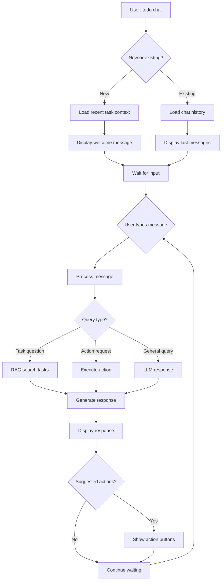

# AI/Chat Flow Design

## Overview

The chat interface is the **primary way users interact** with their tasks. It's designed to feel natural, conversational, and context-aware - similar to the experience we're having right now with opencode.

## Chat Experience

### Session Flow



## Query Types & Handling

### 1. Task Information Queries

**User asks:**
- "What tasks do I have due this week?"
- "Show me all high-priority tasks"
- "What's on my plate today?"

**System flow:**
1. Parse user intent (via LLM)
2. Query database for matching tasks
3. Format response with task summaries
4. Suggest actions (show details, mark done, etc.)

**Example:**
```bash
You: What tasks do I have due this week?

🤖 [Thinking: Interpreting due this week as tasks with ETA in next 7 days]

You have 3 tasks due this week:

📅 Wednesday, January 15:
  1. abc123 ⏰ 2:00 PM • Review PR #123 [high]
     Description: Fix authentication bug in login flow
     Attachment: GitHub PR #123

📅 Friday, January 17:
  2. def456 ⏰ 5:00 PM • Send project update [medium]
     Description: Prepare quarterly review slides
     Attachment: Gmail thread with client

📅 Saturday, January 18:
  3. ghi789 ⏰ 10:00 AM • Fix authentication bug [high]
     Description: JWT token expiration handling
     Attachment: GitHub issue #456

💡 Suggested next steps:
  [1] Show PR #123 details
  [2] Mark PR #123 as in progress
  [3] Open Gmail thread for project update
```

### 2. Action Requests

**User asks:**
- "Mark the PR review as in progress"
- "Add a new task for tomorrow: Call vendor"
- "Delete the project update task"

**System flow:**
1. Parse action via LLM (with context of recent conversation)
2. Execute action via API
3. Confirm action taken
4. Show updated state

**Example:**
```bash
You: Mark the PR review as in progress

🤖 [Thinking: Context refers to PR #123 (abc123)]

✓ Task abc123 updated: pending → in_progress
  Review PR #123
  Status: In Progress
  ETA: 2025-01-15

Would you like me to:
  [1] Show PR details
  [2] Add a subtask for code review
  [3] Nothing, I'll get to work
```

### 3. Attachment Exploration

**User asks:**
- "Show me the Gmail thread for project update"
- "What's in PR #123?"
- "Read the client email from yesterday"

**System flow:**
1. Identify attachment from context
2. Fetch attachment content (if not cached)
3. Display formatted content
4. Suggest related actions

**Example:**
```bash
You: Show me the Gmail thread for project update

🤖 [Fetching Gmail thread...]

Gmail Thread: def456
─────────────────────────────────────────────────────────────
From: client@company.com
To: you@domain.com
Subject: Q1 Review Meeting
Date: January 11, 2025

Hi,

Thanks for the great work on Q1. I'd like to schedule a review
meeting for next week to discuss our roadmap.

Best,
Client

─────────────────────────────────────────────────────────────
[3 more messages in thread]

💡 Actions:
  [1] Reply to email (open in browser)
  [2] Create subtask: Prepare meeting agenda
  [3] Create new task: Schedule review meeting
```

### 4. RAG-Powered Semantic Search

**User asks:**
- "I remember there was something about authentication problems"
- "Show me all tasks related to the client project"
- "What was that issue about JWT tokens?"

**System flow:**
1. Generate query embedding
2. Search vector database (tasks + attachments)
3. Return top matches with relevance scores
4. Present results in natural language

**Example:**
```bash
You: I remember there was something about authentication problems

🤖 [Searching tasks and attachments... "authentication problems"]

Found 3 relevant results (semantic search):

🎯 Most Relevant (0.95):
  Task: ghi789 - Fix authentication bug
  Reasoning: Task title and description discuss authentication issues
  Excerpt: "Users unable to log in after token expiration"
  
📋 Relevant (0.89):
  Attachment from task abc123 - GitHub PR #123
  Reasoning: PR description contains JWT token validation issues
  Excerpt: "The current JWT token validation doesn't properly handle expired tokens"
  
📋 Related (0.72):
  Task: jkl012 - Update documentation
  Reasoning: Documentation mentions authentication flow
  Excerpt: "Updated login sequence diagram and OAuth flow docs"

💡 Would you like to:
  [1] Open task ghi789 (authentication bug)
  [2] View PR #123 details
  [3] See documentation task
```

### 5. Context-Aware Suggestions

**User asks:**
- "What should I focus on right now?"
- "I'm blocked, help me prioritize"
- "Give me a productivity tip"

**System flow:**
1. Analyze current task state (due dates, priorities, status)
2. Consider time of day, week
3. Generate personalized suggestions
4. Present actionable advice

**Example:**
```bash
You: What should I focus on right now?

🤖 [Analyzing 5 pending tasks, time: 10:30 AM on Wednesday...]

🎯 IMMEDIATE (Due within 24 hours):
  None - Good news!

📅 UPCOMING (Due this week):
  • abc123 - Review PR #123 [high, due Wed 2PM]
    You're making good progress - PR has 2 approved reviews
  
  • def456 - Send project update [medium, due Fri 5PM]
    Gmail thread has 3 messages, client is waiting
  
  • ghi789 - Fix authentication bug [high, due Sat 10AM]
    No activity yet, consider blocking time

💡 My Recommendation:
  Start with PR #123 (abc123):
  ✓ You're already familiar with it
  ✓ High priority
  ✓ Good momentum (2 approvals)
  ✓ Due tomorrow afternoon

  Next: Block off 1-2 hours this afternoon to finish it

🚀 Quick Action:
  [1] Mark abc123 as in progress now
  [2] Open PR #123 in browser
  [3] Show me all tasks for this week
```

## RAG Integration

### Architecture

```
User Query
    ↓
[LLM Intent Analysis]
    ↓
[Generate Query Embedding]
    ↓
[Search ChromaDB Vectors]
    ├─→ Task vectors (title, description, tags)
    ├─→ Attachment vectors (cached content)
    └─→ Return top N results
    ↓
[Rerank with LLM] (optional, for better results)
    ↓
[Construct Response with Context]
    ↓
[Generate Answer]
    ↓
Return to User
```

### Document Storage for RAG

Each task creates 2 documents for vector search:

**Task Document:**
```json
{
  "id": "task-abc123",
  "text": "Task: Review PR #123\nPriority: High\nStatus: Pending\nDescription: Fix authentication bug in login flow\nTags: frontend, bug",
  "metadata": {
    "type": "task",
    "task_id": "abc123",
    "priority": "high",
    "status": "pending"
  }
}
```

**Attachment Document:**
```json
{
  "id": "att-abc123-gmail",
  "text": "From: client@company.com\nSubject: Q1 Review Meeting\n\nHi,\n\nThanks for the great work on Q1...",
  "metadata": {
    "type": "attachment",
    "attachment_type": "gmail",
    "task_id": "abc123",
    "from": "client@company.com"
  }
}
```

### Search Strategy

```python
# 1. Generate query embedding
query_embedding = embed_model.encode(user_query)

# 2. Search in parallel
task_results = chroma.query(
    query_embeddings=[query_embedding],
    where={"type": "task"},
    n_results=3
)

attachment_results = chroma.query(
    query_embeddings=[query_embedding],
    where={"type": "attachment"},
    n_results=5
)

# 3. Merge and rerank
all_results = merge_and_rerank(
    task_results,
    attachment_results,
    query_embedding
)

# 4. Generate response
response = llm.generate(
    query=user_query,
    context=all_results,
    conversation_history=recent_messages
)
```

## Prompt Engineering

### System Prompt

```python
SYSTEM_PROMPT = """
You are a helpful AI assistant for a personal task management system.

Your capabilities:
- Answer questions about tasks, priorities, due dates
- Help users organize and prioritize their work
- Execute actions on tasks (create, update, complete, delete)
- Provide context-aware suggestions and recommendations
- Search semantically across tasks and attachments

Your guidelines:
- Be concise but helpful (2-4 sentences per response)
- Ask clarifying questions when needed
- Always suggest specific next steps or actions
- Reference task IDs when mentioning tasks
- Format output with emojis and structure for readability
- Be conversational - use "you" and "we"
- Acknowledge context from previous messages

Available actions:
- create_task(title, description, eta, priority)
- update_task(task_id, field, value)
- mark_done(task_id)
- delete_task(task_id)
- show_task(task_id)
- show_attachment(attachment_id)
- search_tasks(query, include_attachments)

When user asks ambiguous questions:
- "Did you mean task abc123 or def456?"
- "Which task would you like to mark as done?"

When making suggestions:
- Format as: [1] Action 1, [2] Action 2
- Make actions specific and actionable
- Relate to user's current context
"""
```

### Context Prompt

```python
def build_context_prompt(user_query, relevant_tasks, attachments, history):
    prompt = f"""Recent conversation:
{format_history(history)}

Relevant tasks:
{format_tasks(relevant_tasks)}

Relevant attachments:
{format_attachments(attachments)}

User query: {user_query}

Based on the context above, help the user."""
    return prompt
```

## Conversation Management

### Session Handling

```python
class ChatSession:
    def __init__(self, session_id=None):
        self.session_id = session_id or str(uuid4())
        self.messages = []
        self.context = {}  # Current task, attachments in focus
    
    def add_message(self, role, content):
        self.messages.append({
            "role": role,
            "content": content,
            "timestamp": datetime.now()
        })
    
    def get_recent_context(self, limit=5):
        return self.messages[-limit:]
    
    def save_to_db(self):
        # Persist session for later
        pass
```

### Context Tracking

```python
# When user asks "show me details"
# Track that they're looking at task abc123
session.context["current_task"] = "abc123"

# When user then asks "mark it as done"
# Use context to infer they mean task abc123
task_id = session.context.get("current_task")
update_task(task_id, status="completed")
```

## Streaming Responses

### Implementation

```python
from fastapi.responses import StreamingResponse

async def chat_stream(request: ChatRequest):
    async def generate():
        # Generate response token by token
        async for token in llm.stream_async(request.message):
            yield f"data: {token}\n\n"
        yield "data: [DONE]\n\n"
    
    return StreamingResponse(
        generate(),
        media_type="text/event-stream"
    )
```

### Frontend Handling (Web UI)

```javascript
const eventSource = new EventSource('/api/chat/stream');
eventSource.onmessage = (event) => {
    if (event.data === '[DONE]') {
        eventSource.close();
    } else {
        chatContainer.textContent += event.data;
    }
};
```

## Error Handling

### Graceful Degradation

```python
try:
    # Attempt RAG search
    results = rag_search(query)
except RAGNotAvailableError:
    # Fall back to keyword search
    results = keyword_search(query)
    user_message = "Search available, using basic matching..."
except LLMNotAvailableError:
    # Return structured response without AI
    return structured_response(query)
```

### Clear Error Messages

```bash
# AI not configured
You: What tasks are due?

⚠️  LLM not configured. Please run:
  $ todo config --llm openrouter --api-key YOUR_KEY

In the meantime, I can show you tasks using basic search:

Tasks Due This Week:
  [1] abc123 - Review PR #123 (Wed 2PM)
  [2] def456 - Send project update (Fri 5PM)
```

## Performance Considerations

### Caching Strategy

1. **Task Queries** - Cache list for 30 seconds
2. **RAG Searches** - Cache query results for 5 minutes
3. **Attachment Content** - Cache Gmail/GitHub for 1 hour
4. **Embeddings** - Cache in ChromaDB (persistent)

### Latency Targets

| Operation | Target | Rationale |
|-----------|---------|-----------|
| Simple query | < 500ms | Instant response |
| RAG search | < 2s | Acceptable for complex search |
| LLM generation | < 5s first token | Streaming hides latency |
| Attachment fetch | < 1s | Should be cached |

## Multi-Provider LLM Support

### Provider Abstraction

```python
class LLMProvider:
    async def generate(self, prompt, **kwargs):
        raise NotImplementedError
    
    async def stream(self, prompt, **kwargs):
        raise NotImplementedError

class OpenRouterProvider(LLMProvider):
    async def generate(self, prompt, model="anthropic/claude-3-haiku"):
        # Call OpenRouter API
        pass

class LocalOllamaProvider(LLMProvider):
    async def generate(self, prompt, model="llama2"):
        # Call local Ollama
        pass

# Factory pattern
def get_provider(config):
    provider_type = config.get("provider")
    if provider_type == "openrouter":
        return OpenRouterProvider(config)
    elif provider_type == "ollama":
        return LocalOllamaProvider(config)
```

## Feedback & Learning

### Implicit Feedback

```python
# Track which actions users take after suggestions
# Example: User asks for suggestion, then marks task done
# → Learn to suggest marking done more often
```

### Explicit Feedback

```bash
# After response
🤖 Does this help? [1] Yes, [2] No, [3] Partially

You: 1

# Store feedback for model improvement
```

## Testing the Chat Experience

### Scenarios to Validate

1. **New user** - "I have 5 tasks, help me prioritize"
2. **Context switching** - "Now tell me about the PR"
3. **Ambiguity** - "Mark it done" (which task?)
4. **RAG failure** - "Find something about security"
5. **LLM offline** - "What's due today?" (fall back to structured)
6. **Multiple attachments** - "Show me all emails from client"
7. **Time-based** - "What should I do this afternoon?"
8. **Complex query** - "I need to prepare for meeting with client tomorrow, what do I need?"
