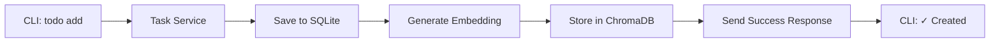
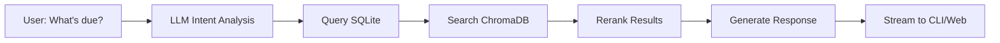
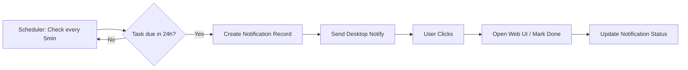

# Design Summary - Quick Reference

## What We're Building

A **CLI-first, AI-native personal task manager** with:
- Conversational chat interface (like opencode)
- Gmail + GitHub attachment support
- RAG-powered semantic search
- Desktop notifications
- Docker containerization
- BYOK + OpenRouter support

## Key Differentiators vs Competitors

| Feature | dstask | Taskosaur | Our System |
|---------|---------|-----------|-------------|
| CLI-first | ✅ | ❌ | ✅ |
| AI chat | ❌ | ✅ | ✅ |
| RAG search | ❌ | ❌ | ✅ |
| Gmail integration | ❌ | ❌ | ✅ |
| GitHub attachments | ❌ | ❌ | ✅ |
| Desktop notifications | ❌ | ❌ | ✅ |
| BYOK support | ❌ | ✅ | ✅ |
| Personal-focused | ✅ | ❌ | ✅ |
| Simple architecture | ✅ | ❌ | ✅ |

## Tech Stack

### Backend
- **FastAPI** - Async, type-safe, Python-native
- **SQLAlchemy** - ORM, easy migrations
- **SQLite** - Simple, portable, can upgrade to Postgres
- **ChromaDB** - Local vector store for RAG
- **APScheduler** - Notification scheduling
- **plyer** - Cross-platform desktop notifications

### CLI
- **Typer** - Modern, type hints, auto-help
- **Rich** - Beautiful terminal output
- **Shell completion** - bash/zsh/fish support

### Web UI
- **HTMX + Jinja2** - Minimal JS, server-rendered
- **Tailwind CSS** - Rapid, modern styling
- **WebSocket** - Real-time chat streaming
- **No frameworks** - Lightweight, fast

### Integrations
- **Google API Python Client** - Gmail OAuth and fetching
- **PyGithub** - GitHub API for PRs/issues
- **OpenAI SDK** - OpenRouter + OpenAI + Anthropic support

### Deployment
- **Docker Compose** - One-command setup
- **Auto-start** - systemd service (optional)
- **Local-only** - No cloud dependencies

## User Journey

### Setup (5 minutes)
```bash
# Clone and setup
git clone https://github.com/user/personal-todo.git
cd personal-todo

# Configure
todo config --llm openrouter --api-key YOUR_KEY
todo config --gmail-auth  # Optional, opens browser
docker compose up -d

# Done! System running on http://localhost:8080
```

### Daily Use

**Morning - Check what's due:**
```bash
$ todo chat
You: What do I have due today?
🤖 You have 2 tasks due today:
  1. Review PR #123 [high]
  2. Client meeting [medium]
```

**Add task from email:**
```bash
# Found important email in Gmail
$ todo attach abc123 --type gmail --ref 18e4f7a2b3c
✓ Gmail attached to task abc123
```

**Get help prioritizing:**
```bash
$ todo chat
You: What should I focus on today?
🤖 Based on 3 pending tasks:
  • Start with PR #123 (high priority, 2 approvals)
  • Block 2 hours for client meeting prep
  • Work on authentication bug in afternoon
```

**Evening - Progress:**
```bash
$ todo done abc123
✓ Task completed
🔔 Desktop notification shows task completed

$ todo chat
You: What's left for tomorrow?
🤖 1 task due tomorrow:
  • Send project update (medium priority)
```

## Architecture Diagram

```
CLI (Typer)          Web UI (HTMX)          API (FastAPI)
    │                      │                         │
    └──────────────────────┼─────────────────────────┘
                           │
                           ▼
                    ┌─────────────────┐
                    │  Task Service  │
                    └────────┬────────┘
                             │
              ┌──────────────┼──────────────┐
              ▼              ▼              ▼
        ┌──────────┐  ┌──────────┐  ┌──────────┐
        │  SQLite  │  │ ChromaDB │  │  Gmail    │
        │  (Tasks) │  │  (RAG)   │  │  Service  │
        └──────────┘  └──────────┘  └──────────┘
                             │
                             ▼
                    ┌─────────────────┐
                    │ Notification    │
                    │ Scheduler      │
                    └────────┬────────┘
                             ▼
                    ┌─────────────────┐
                    │ Desktop Notify  │
                    │   (plyer)     │
                    └─────────────────┘
```

## Data Flow Examples

### Adding a Task


### Chat Query


### Notification Trigger


## File Structure

```
personal-todo/
├── backend/
│   ├── __init__.py
│   ├── main.py                 # FastAPI app
│   ├── database.py             # SQLite + SQLAlchemy
│   ├── models/                # Pydantic schemas
│   │   ├── task.py
│   │   ├── attachment.py
│   │   └── chat.py
│   ├── services/              # Business logic
│   │   ├── task_service.py
│   │   ├── llm_service.py
│   │   ├── rag_service.py
│   │   ├── notification_service.py
│   │   └── integrations/
│   │       ├── gmail.py
│   │       └── github.py
│   └── templates/             # Jinja2 templates
│       ├── base.html
│       ├── chat.html
│       └── tasks.html
├── cli/
│   ├── __init__.py
│   ├── main.py                 # Typer CLI
│   ├── commands/
│   │   ├── add.py
│   │   ├── list.py
│   │   ├── chat.py
│   │   └── ...
│   └── utils.py               # Rich output helpers
├── tests/
│   ├── test_tasks.py
│   ├── test_chat.py
│   └── test_rag.py
├── docker/
│   ├── Dockerfile
│   └── docker-compose.yml
├── requirements.txt
├── pyproject.toml
└── README.md
```

## Implementation Timeline

### Phase 1: MVP (Weeks 1-8)
- [ ] Week 1-2: Core infrastructure
  - FastAPI backend, SQLite database
  - Typer CLI for add/list/show/edit/delete
  - Docker Compose setup
- [ ] Week 3-4: AI integration
  - OpenRouter + BYOK support
  - Basic chat endpoint (non-RAG)
  - LLM configuration management
- [ ] Week 5-6: Web UI
  - HTMX + Jinja2 templates
  - Chat interface with streaming
  - Task list and detail pages
- [ ] Week 7-8: Notifications
  - Desktop notifications (plyer)
  - Notification scheduler (24h, 6h before ETA)
  - Notification preferences

### Phase 2: Differentiators (Weeks 9-16)
- [ ] Week 9-10: Gmail integration
  - Gmail OAuth flow
  - Email fetching and parsing
  - Attach emails to tasks
- [ ] Week 11-12: GitHub integration
  - GitHub API integration
  - Fetch PR/issue details
  - Attach GitHub items to tasks
- [ ] Week 13-14: RAG system
  - ChromaDB integration
  - Embedding generation
  - Semantic search
  - Chat with RAG context
- [ ] Week 15-16: Polish
  - Shell completion
  - Better error messages
  - Performance optimization

### Phase 3: Advanced Features (Weeks 17+)
- [ ] TUI mode (optional)
- [ ] Mobile notifications (Google Space)
- [ ] Smart suggestions (ML)
- [ ] Task dependencies
- [ ] Subtasks
- [ ] Export/Import

## Configuration Files

### ~/.todo/config.toml
```toml
[llm]
provider = "openrouter"
model = "anthropic/claude-3-haiku"
api_key = "sk-or-v1-..."

[gmail]
enabled = true
credentials_path = "~/.todo/credentials.json"

[github]
enabled = true
token = "ghp_..."

[notifications]
enabled = true
schedule = ["24h", "6h"]
sound_enabled = true
quiet_hours = {"start": "22:00", "end": "08:00"}

[database]
path = "~/.todo/data/todo.db"

[web]
port = 8080
host = "localhost"
```

## API Endpoints

### Tasks
- `POST /api/tasks` - Create task
- `GET /api/tasks` - List tasks (with filters)
- `GET /api/tasks/{id}` - Get task details
- `PATCH /api/tasks/{id}` - Update task
- `DELETE /api/tasks/{id}` - Delete task
- `POST /api/tasks/{id}/done` - Mark complete

### Attachments
- `POST /api/attachments` - Create attachment
- `GET /api/attachments/{id}` - Get attachment
- `DELETE /api/attachments/{id}` - Delete attachment

### Chat
- `POST /api/chat` - Send chat message
- `GET /api/chat/stream` - SSE stream
- `GET /api/chat/history` - Get conversation

### Search
- `GET /api/search` - Keyword search
- `GET /api/search/semantic` - RAG search

## CLI Commands Reference

```bash
# Task Management
todo add "Task title" [-d desc] [-e eta] [-p priority] [-a attachment]
todo list [--status STATUS] [--priority PRI] [--due DATE]
todo show <task_id>
todo edit <task_id> [options]
todo done <task_id>
todo delete <task_id>

# Chat Interface
todo chat                          # Start chat session
todo chat --continue              # Continue last session
todo chat --new               # Start new session

# Attachments
todo attach <task_id> --type TYPE --ref REFERENCE

# Configuration
todo config                        # Show current config
todo config --llm PROVIDER          # Set LLM provider
todo config --api-key KEY           # Set API key
todo config --gmail-auth             # Configure Gmail
todo config --notify SCHEDULE        # Set notification schedule

# Web UI
todo ui                            # Launch web interface
todo ui --port 9000             # Specify port

# Data
todo export --format json           # Export tasks
todo import --file backup.json      # Import tasks
todo search <query>              # Search tasks
```

## Design Documents Created

1. **DESIGN_ARCHITECTURE.md** - System architecture, service boundaries
2. **DESIGN_CLI.md** - Detailed CLI command design with examples
3. **DESIGN_DATA.md** - Database schemas, Pydantic models, JSON examples
4. **DESIGN_CHAT.md** - AI/chat flow, RAG integration, prompt engineering
5. **DESIGN_WEB.md** - Web UI pages, components, HTMX interactions
6. **DESIGN_NOTIFICATIONS.md** - Notification system, scheduling, templates

## Next Steps

### For User Review
- [ ] Review architecture (DESIGN_ARCHITECTURE.md)
- [ ] Review CLI design (DESIGN_CLI.md)
- [ ] Review data models (DESIGN_DATA.md)
- [ ] Review chat flow (DESIGN_CHAT.md)
- [ ] Review web UI (DESIGN_WEB.md)
- [ ] Review notifications (DESIGN_NOTIFICATIONS.md)

### After Approval
- [ ] Finalize tech stack
- [ ] Create repository structure
- [ ] Set up development environment
- [ ] Begin Phase 1 implementation

## Key Decisions Made

### Why Python/FastAPI?
- **AI ecosystem:** Python has best LLM/RAG libraries
- **Async native:** FastAPI built for async operations
- **Type hints:** Type-safe, easy maintenance
- **Simpler:** Single language, no separate backend/frontend

### Why SQLite + ChromaDB?
- **Local only:** No external services needed
- **Simple:** Single-file database, easy backup
- **Portable:** Works in Docker, easy to migrate later
- **Fast:** Good enough for personal use

### Why CLI-first?
- **Scriptable:** Can be automated
- **SSH-friendly:** Works perfectly remotely
- **Familiar:** Like git, docker, kubectl
- **Fast:** No web latency for quick commands

### Why Chat Interface?
- **Natural:** Ask "what's due?" instead of "todo list --status pending"
- **Context-aware:** Remembers conversation
- **RAG-powered:** Searches across all attachments
- **Actionable:** Suggests and executes actions directly

## Risks & Mitigations

### Risk 1: Complexity creep
**Mitigation:**
- Strict MVP scope (8 weeks)
- Phase-based development
- Ship and iterate

### Risk 2: RAG quality
**Mitigation:**
- Start with keyword search
- Add RAG in Phase 2
- User feedback loop

### Risk 3: Integration reliability
**Mitigation:**
- Graceful degradation (API failures)
- Caching strategies
- Clear error messages

### Risk 4: User adoption
**Mitigation:**
- Great CLI UX (completion, colors)
- Clear documentation
- Quick onboarding (5-minute setup)
- Natural chat interface

## Success Metrics

### MVP (Week 8)
- Working CLI with CRUD
- Chat interface with AI
- Docker container running
- Desktop notifications
- 100 GitHub stars

### Phase 2 (Week 16)
- Gmail integration
- GitHub integration
- RAG search
- 500 GitHub stars

### Phase 3 (Week 52)
- 2,000 GitHub stars
- 10 active contributors
- Featured in tech communities

---

**Ready to proceed with implementation?**
