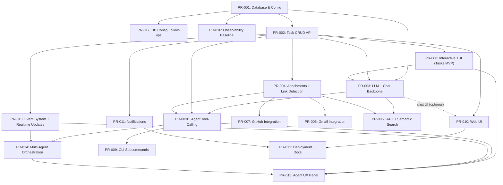
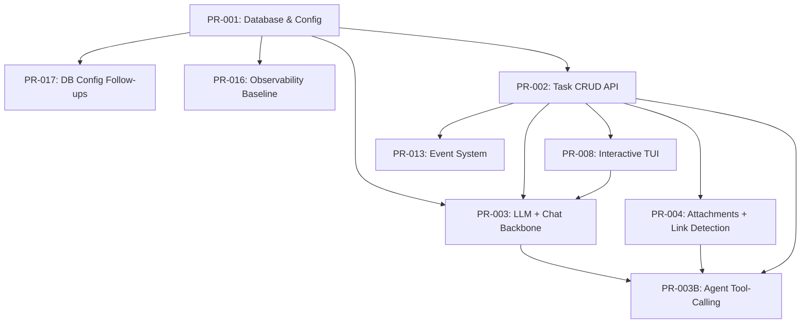
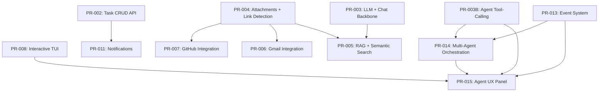
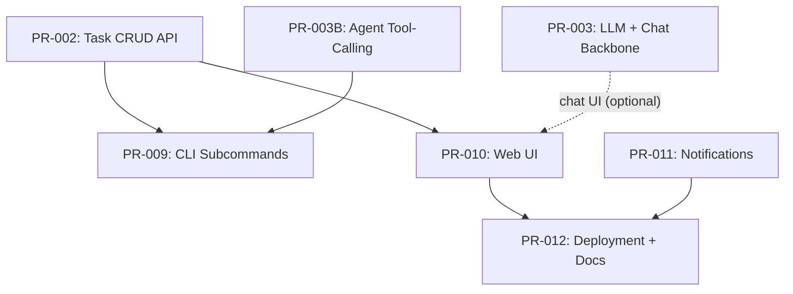

# Implementation Plan: Pull Requests

**Status:** Spec Complete | Implementation In Progress
**Last Reviewed:** 2025-12-31
**Total PRs:** 18 (PR-001 through PR-012, plus PR-003B and PR-013 through PR-017)

## Overview

This document tracks all planned Pull Requests for the TaskGenie project. The plan follows an **Interactive TUI-First** strategy, with chat as the primary capability within the interactive interface.

## Objective (North Star)

Ship a **local-first task manager** where a user can run `tgenie`, manage tasks in an interactive TUI, and use chat as the primary workflow (with RAG + integrations layered on later).

**Strategy:**
1.  **Foundation:** DB + Task API (unblocks everything)
2.  **Observability:** Structured logs + telemetry early to de-risk debugging
3.  **UX First:** Interactive TUI early, iterate fast on usability
4.  **Chat Next:** Add LLM chat inside the TUI once the UX shell exists
5.  **Agent Foundations:** Tool-calling + event system for safe actions and updates
6.  **Feature Delivery:** Add attachments, then ship the earliest “tryable” features (Notifications and/or Integrations)
7.  **Intelligence:** RAG + semantic search to level-up chat and discovery
8.  **Polish:** Agent UX + Web UI (optional) + deployment/docs

> **Note:** The primary UX is an interactive TUI entered via `tgenie` (default), with chat as the main mode. Non-interactive subcommands (`tgenie add`, `tgenie list`, etc.) exist for scripting and automation.

---

## Design References

- Interactive TUI: `docs/01-design/DESIGN_TUI.md`
- Background jobs (no queue MVP): `docs/01-design/DESIGN_BACKGROUND_JOBS.md`
- Core architecture: `docs/01-design/DESIGN_ARCHITECTURE.md`
- Skill enrichment tags: `docs/02-implementation/SKILL_ENRICHMENT_SUMMARY.md`

## Recommended Execution Order (UX-First)

This sequence prioritizes **something usable early** (good UX) and then adds capabilities bit-by-bit.

| Seq | PR | Title | Why now? | Depends on | Skill Enrichment |
|---:|---|---|---|---|---|
| 1 | PR-001 | Database & Configuration | Foundation + migrations | - | - |
| 2 | PR-017 | DB Config Follow-ups | Close PR-001 gaps | PR-001 | - |
| 3 | PR-016 | Observability Baseline | De-risk debugging early | PR-001 | - |
| 4 | PR-002 | Task CRUD API | Core workflows + enables clients | PR-001 | api-testing |
| 5 | PR-008 | Interactive TUI (Tasks MVP) | Validate UX early | PR-002 | tui-dev |
| 6 | PR-003 | LLM + Chat Backbone | Make chat real (provider + API + TUI) | PR-001, PR-002, PR-008 | api-testing, tui-dev |
| 7 | PR-004 | Attachments + Link Detection | Context capture for real work | PR-002 | task-workflow |
| 8 | PR-013 | Event System + Realtime Updates | Enable subscriptions + hooks | PR-002 | - |
| 9 | PR-003B | Agent Tool-Calling Foundation | Safe tool execution | PR-003, PR-002, PR-004 | - |
| 10 | PR-011 | Notifications | Early \"daily value\" | PR-002 | task-workflow |
| 11 | PR-007 | GitHub Integration | High-value for dev tasks | PR-004 | integration-setup |
| 12 | PR-006 | Gmail Integration | High-value, higher complexity | PR-004 | integration-setup |
| 13 | PR-005 | RAG + Semantic Search | Better recall + better chat | PR-003, PR-004 | rag-testing, context-optimization, context-compression |
| 14 | PR-014 | Multi-Agent Orchestration | Coordinated agent runs | PR-003B, PR-013 | - |
| 15 | PR-015 | Agent UX Panel | Visibility + controls | PR-008, PR-003B, PR-013, PR-014 | - |
| 16 | PR-009 | CLI Subcommands (Secondary) | Scriptable workflows + agent CLI | PR-002, PR-003B | task-workflow |
| 17 | PR-010 | Web UI | Secondary UX for rich preview | PR-002 (chat optional: PR-003) | - |
| 18 | PR-012 | Deployment + Docs | Make it easy to run/share | PR-010, PR-011 | - |

Notes:
- You can swap **Seq 10–13** based on what you can test earliest (notifications vs integrations vs RAG).
- PR-010 can be started earlier for task pages, but chat streaming needs PR-003.
- PR-015 depends on PR-014 for agent run endpoints.
- Specs (with test scenarios): `pr-specs/INDEX.md`

## PR Dependency Diagram

Notes:
- Edges reflect planned dependency relationships.
- PR-010 can ship “tasks-only” early; chat streaming waits on PR-003.

## Dependency Diagrams by Phase

These diagrams break the full dependency graph into smaller, phase-focused views.

### Phase 1-3 (Foundation, UX, Chat, Attachments, Agent Foundations)

### Phase 4-6 (Early Value, Intelligence, Agent Orchestration + UX)

### Phase 7-8 (Secondary UIs + Scripting, Deploy + Docs)

## Phase 1: Foundation + Observability + UX MVP (Weeks 1-2)

### PR-001: Database & Configuration Setup
**Branch:** `feature/db-config`
**Status:** ✅ Implemented
**Description:** Initialize SQLite database with migrations and environment configuration.
**Spec:** `pr-specs/PR-001-db-config.md`
**Files to modify:**
- `backend/database.py` - Complete database initialization (Async SQLAlchemy)
- `backend/config.py` - Add configuration for migrations
- `backend/main.py` - Basic FastAPI app structure
**Acceptance Criteria:**
- [ ] Database creates tables on startup
- [ ] Environment variables load correctly
- [ ] Tests pass for database operations

### PR-017: DB Config Follow-ups
**Branch:** `feature/db-config-followups`
**Status:** ⬜ Not Started
**Dependency:** PR-001
**Description:** Close gaps after PR-001 (dir creation, restore safety, FK enforcement, docs alignment).
**Spec:** `pr-specs/PR-017-db-config-followups.md`
**Acceptance Criteria:**
- [ ] `data/chroma` directory is created in app data dir
- [ ] `tgenie db restore` prompts unless `--yes` is provided
- [ ] SQLite foreign keys are enforced on every connection

### PR-016: Observability Baseline
**Branch:** `feature/observability-baseline`
**Status:** ⬜ Not Started
**Dependency:** PR-001
**Description:** Structured JSON logs, request IDs, and a lightweight telemetry endpoint.
**Spec:** `pr-specs/PR-016-observability-baseline.md`
**Acceptance Criteria:**
- [ ] Logs include request IDs in JSON format
- [ ] `/api/v1/telemetry` reports DB health and migration version

### PR-002: Task CRUD API Endpoints
**Branch:** `feature/task-crud`
**Status:** ⬜ Not Started
**Dependency:** PR-001
**Description:** Create REST API endpoints for basic task management.
**Spec:** `pr-specs/PR-002-task-crud-api.md`
**Files to modify:**
- `backend/api/tasks.py` - Create API routes
- `backend/schemas/task.py` - Pydantic models
**Acceptance Criteria:**
- [ ] CRUD Endpoints (POST, GET, PATCH, DELETE) working
- [ ] Status transitions working
- [ ] Unit tests for API endpoints

### PR-008: CLI Interactive TUI Interface (Tasks MVP)
**Branch:** `feature/cli-core`
**Status:** ⬜ Not Started
**Dependency:** PR-002
**Description:** The `tgenie` command entry point. Ships an interactive TUI early for core task workflows (chat can be a stub until PR-003).
**Spec:** `pr-specs/PR-008-interactive-tui.md`
**Files to modify:**
- `backend/cli/main.py` - launch the TUI by default
- `backend/cli/tui/*` - Textual app, screens/widgets, API client
**Acceptance Criteria:**
- [ ] `tgenie` opens interactive TUI
- [ ] Core task flows work end-to-end (create/list/show/edit/done)
- [ ] Chat UI can be present as placeholder until PR-003

---

## Phase 2: Chat + Attachments (Weeks 3-4)

### PR-003: LLM + Chat Backbone
**Branch:** `feature/llm-chat-backbone`
**Status:** ⬜ Not Started
**Dependency:** PR-001, PR-002, PR-008
**Description:** Provider configuration + streaming API + TUI wiring (tool-calling is in PR-003B).
**Spec:** `pr-specs/PR-003-llm-chat-backbone.md`
**Acceptance Criteria:**
- [ ] Chat endpoint returns a streaming response.
- [ ] TUI can send a message and display a streamed reply.
- [ ] Missing/invalid API key results in a clear error message (in TUI and API).
- [ ] Provider selection (model/base_url) works via config.

### PR-004: Attachment API & Link Detection
**Branch:** `feature/attachments`
**Status:** ⬜ Not Started
**Dependency:** PR-002
**Description:** API for attachments and auto-detection service.
**Spec:** `pr-specs/PR-004-attachments-link-detection.md`
**Files to modify:**
- `backend/api/attachments.py` - CRUD for attachments
- `backend/services/link_detection.py` - Regex matcher for URLs
- `backend/schemas/attachment.py`
**Acceptance Criteria:**
- [ ] Manual attachment API works
- [ ] Detecting a URL in task description auto-creates attachment

---

## Phase 3: Agent Foundations + Events (Weeks 5-6)

### PR-013: Event System + Realtime Updates
**Branch:** `feature/event-system`
**Status:** ⬜ Not Started
**Dependency:** PR-002
**Description:** Event log + SSE stream for task/attachment lifecycle events.
**Spec:** `pr-specs/PR-013-event-system.md`
**Acceptance Criteria:**
- [ ] Task and attachment changes emit events
- [ ] SSE stream supports reconnect with `Last-Event-ID`

### PR-003B: Agent Tool-Calling Foundation
**Branch:** `feature/agent-tools`
**Status:** ⬜ Not Started
**Dependency:** PR-003, PR-002, PR-004
**Description:** Tool schema + execution pipeline for safe agent actions.
**Spec:** `pr-specs/PR-003B-agent-tool-calling.md`
**Acceptance Criteria:**
- [ ] Tool schema exposed to LLM provider
- [ ] Tool calls execute with validation and timeouts
- [ ] Destructive tools require confirmation

---

## Phase 4: Early Value Track (Weeks 7-8)

This phase is intentionally flexible: pick what’s easiest to validate early from a user POV.

### PR-011: Notification Service
**Branch:** `feature/notifications`
**Status:** ⬜ Not Started
**Dependency:** PR-002
**Description:** Reminders (24h/6h/overdue) based on task ETA; delivery via desktop notifications and/or in-app notifications depending on environment.
**Spec:** `pr-specs/PR-011-notifications.md`
**Files to modify:**
- `backend/services/notification_service.py`
**Acceptance Criteria:**
- [ ] Notifications trigger 24h/6h before deadline (and overdue)

### PR-007: GitHub Integration
**Branch:** `feature/github-integration`
**Status:** ⬜ Not Started
**Dependency:** PR-004
**Description:** Fetch Issue/PR details by URL and store as cached attachment content.
**Spec:** `pr-specs/PR-007-github-integration.md`
**Files to modify:**
- `backend/integrations/github.py`
**Acceptance Criteria:**
- [ ] Fetch Issue/PR details by URL
- [ ] Attachment content is cached for later search

### PR-006: Gmail Integration
**Branch:** `feature/gmail-integration`
**Status:** ⬜ Not Started
**Dependency:** PR-004
**Description:** Gmail OAuth + email fetching by URL; store as cached attachment content.
**Spec:** `pr-specs/PR-006-gmail-integration.md`
**Files to modify:**
- `backend/integrations/gmail.py`
**Acceptance Criteria:**
- [ ] OAuth flow working
- [ ] Fetch email content by URL and cache it as an attachment

---

## Phase 5: Intelligence (Weeks 9-10)

### PR-005: RAG + Semantic Search
**Branch:** `feature/rag-semantic-search`
**Status:** ⬜ Not Started
**Dependency:** PR-003, PR-004
**Description:** Vector store + indexing + semantic search + chat context injection (single PR spec for now; see “Potential Future Splits”).
**Spec:** `pr-specs/PR-005-rag-semantic-search.md`
**Acceptance Criteria:**
- [ ] Tasks and cached attachments are embedded and indexed automatically.
- [ ] Semantic search returns relevant results for representative queries.
- [ ] Chat responses cite retrieved task/attachment context where applicable.

---

## Phase 6: Agent Orchestration + UX (Weeks 11-12)

### PR-014: Multi-Agent Orchestration
**Branch:** `feature/multi-agent`
**Status:** ⬜ Not Started
**Dependency:** PR-003B, PR-013
**Description:** Run management and coordination for multi-agent workflows.
**Spec:** `pr-specs/PR-014-multi-agent-orchestration.md`
**Acceptance Criteria:**
- [ ] Agent runs can be started, paused, and canceled
- [ ] Run status is persisted and queryable

### PR-015: Agent UX Panel
**Branch:** `feature/agent-ux`
**Status:** ⬜ Not Started
**Dependency:** PR-008, PR-003B, PR-013, PR-014
**Description:** TUI panel for agent status, tool execution, and controls.
**Spec:** `pr-specs/PR-015-agent-ux-panel.md`
**Acceptance Criteria:**
- [ ] Agent panel updates in real time
- [ ] Pause/resume/cancel controls work

---

## Phase 7: Secondary UIs + Scripting (Weeks 13-14)

### PR-009: CLI Standard Commands (Secondary)
**Branch:** `feature/cli-commands`
**Status:** ⬜ Not Started
**Dependency:** PR-002, PR-003B
**Description:** Standard commands for scripting plus agent run/status commands.
**Spec:** `pr-specs/PR-009-cli-subcommands.md`
**Files to modify:**
- `backend/cli/commands.py`
**Acceptance Criteria:**
- [ ] `tgenie list`, `tgenie add` work as subcommands (for scripting)
- [ ] `tgenie agent run` and `tgenie agent status` return usable results
- [ ] Rich terminal output

### PR-010: Web UI (Chat & Tasks)
**Branch:** `feature/web-ui`
**Status:** ⬜ Not Started
**Dependency:** PR-002 (chat optional: PR-003)
**Description:** HTMX + Jinja2 Web Interface (tasks first; chat streaming once PR-003 exists).
**Spec:** `pr-specs/PR-010-web-ui.md`
**Files to modify:**
- `backend/templates/*`
- `backend/api/web.py`
**Acceptance Criteria:**
- [ ] Task management pages
- [ ] Chat interface with streaming (if PR-003 is implemented)
- [ ] Responsive design

---

## Phase 8: Deploy + Docs (Weeks 15-16)

### PR-012: Deployment & Documentation
**Branch:** `feature/deploy`
**Status:** ⬜ Not Started
**Dependency:** PR-010, PR-011
**Description:** Docker polish, comprehensive README, and final docs.
**Spec:** `pr-specs/PR-012-deployment-docs.md`
**Acceptance Criteria:**
- [ ] `docker compose up` works flawlessly
- [ ] User guide complete

---

## Summary Timeline

| Phase | Focus | Weeks | Key PRs |
|-------|-------|--------|----------|
| **1** | **Foundation + Observability + UX MVP** | 1-2 | PR-001 (DB), PR-017 (DB follow-ups), PR-016 (Observability), PR-002 (Task API), PR-008 (TUI Tasks) |
| **2** | **Chat + Attachments** | 3-4 | PR-003 (Chat backbone), PR-004 (Attachments) |
| **3** | **Agent Foundations + Events** | 5-6 | PR-013 (Events), PR-003B (Tool-calling) |
| **4** | **Early Value Track** | 7-8 | PR-011 (Notifications) and/or PR-007 (GitHub) / PR-006 (Gmail) |
| **5** | **Intelligence** | 9-10 | PR-005 (RAG + Semantic Search) |
| **6** | **Agent Orchestration + UX** | 11-12 | PR-014 (Multi-agent), PR-015 (Agent UX) |
| **7** | **Secondary UIs + Scripting** | 13-14 | PR-009 (CLI subcommands), PR-010 (Web UI) |
| **8** | **Deploy + Docs** | 15-16 | PR-012 (Deployment & Docs) |

**Total Estimated Effort:** ~140 hours (≈16–18 weeks at ~8h/week, or ≈4 weeks full-time)

**Skill Integration:**
- `api-testing`: PR-002, PR-003
- `rag-testing`: PR-005
- `integration-setup`: PR-006, PR-007
- `tui-dev`: PR-008, PR-003
- `context-optimization`: PR-005
- `context-compression`: PR-005 (future chat history)
- `task-workflow`: PR-004, PR-009, PR-011

## Potential Future Splits (Not Part of Current Specs)

If additional splits are needed, prefer numeric suffixes (e.g., `PR-003-1`, `PR-003-2`) for easier sorting. PR-003B is reserved for the tool-calling foundation.

- PR-003 (candidate):
  - `PR-003-1`: LLM provider config + service abstraction
  - `PR-003-2`: Streaming chat API (SSE)
  - `PR-003-3`: TUI chat integration
- PR-005 (candidate):
  - `PR-005-1`: Vector store + embeddings + indexing
  - `PR-005-2`: Semantic search + RAG context injection
