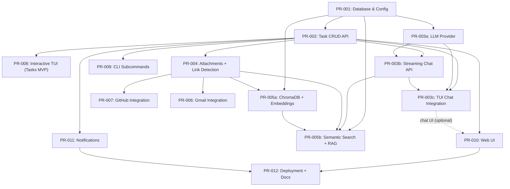

# Implementation Plan: Pull Requests

**Status:** Spec Complete | Implementation In Progress
**Last Reviewed:** 2025-12-31
**Total PRs:** 17 (PR-001 through PR-012, plus breakdowns: PR-003a/b/c, PR-005a/b)

## Overview

This document tracks all planned Pull Requests for the TaskGenie project. The plan follows an **Interactive TUI-First** strategy, with chat as the primary capability within the interactive interface.

**Strategy:**
1.  **Foundation:** DB + Task API (unblocks everything)
2.  **UX First:** Interactive TUI early, iterate fast on usability
3.  **Chat Next:** Add LLM chat inside the TUI once the UX shell exists
4.  **Feature Delivery:** Add attachments, then ship the earliest “tryable” features (Notifications and/or Integrations)
5.  **Intelligence:** RAG + semantic search to level-up chat and discovery
6.  **Polish:** Web UI (optional) + deployment/docs

> **Note:** The primary UX is an interactive TUI entered via `tgenie` (default), with chat as the main mode. Non-interactive subcommands (`tgenie add`, `tgenie list`, etc.) exist for scripting and automation.

---

## Design References

- Interactive TUI: `docs/01-design/DESIGN_TUI.md`
- Background jobs (no queue MVP): `docs/01-design/DESIGN_BACKGROUND_JOBS.md`
- Core architecture: `docs/01-design/DESIGN_ARCHITECTURE.md`

## Recommended Execution Order (UX-First)

This sequence prioritizes **something usable early** (good UX) and then adds capabilities bit-by-bit.

| Seq | PR | Title | Why now? | Depends on | Skill Enrichment |
|---:|---|---|---|---|
| 1 | PR-001 | Database & Configuration | Foundation + migrations | - | - |
| 2 | PR-002 | Task CRUD API | Core workflows + enables clients | PR-001 | api-testing |
| 3 | PR-008 | Interactive TUI (Tasks MVP) | Validate UX early | PR-002 | tui-dev |
| 4 | PR-003a | LLM Provider Abstraction | Provider configuration foundation | PR-001 | - |
| 5 | PR-003b | Streaming Chat API | API surface for chat | PR-001, PR-002, PR-003a | api-testing |
| 6 | PR-003-3 | TUI Chat Integration | Make chat real inside TUI | PR-002, PR-003-1, PR-003-2 | tui-dev |
| 7 | PR-009 | CLI Subcommands (Secondary) | Scriptable workflows | PR-002 | task-workflow |
| 8 | PR-004 | Attachments + Link Detection | Context capture for real work | PR-002 | task-workflow |
| 9 | PR-011 | Notifications | Early "daily value" | PR-002 | task-workflow |
| 10 | PR-007 | GitHub Integration | High-value for dev tasks | PR-004 | integration-setup |
| 11 | PR-006 | Gmail Integration | High-value, higher complexity | PR-004 | integration-setup |
| 12 | PR-005-1 | ChromaDB + Embeddings | Vector store foundation | PR-001, PR-004 | rag-testing |
| 13 | PR-005-2 | Semantic Search + RAG | Better recall + better chat | PR-001, PR-003-2, PR-004, PR-005-1 | rag-testing, context-optimization, context-compression |
| 14 | PR-010 | Web UI | Secondary UX for rich preview | PR-002 (chat optional: PR-003-2) | - |
| 15 | PR-012 | Deployment + Docs | Make it easy to run/share | PR-010, PR-011 | - |

Notes:
- You can swap **Seq 7–9** based on what you can test earliest (notifications vs integrations).
- PR-010 can be started earlier for task pages, but chat streaming needs PR-003-2.
- Specs (with test scenarios): `pr-specs/INDEX.md`

## PR Dependency Diagram

Notes:
- PR-003 has been split into PR-003a (provider), PR-003b (API), PR-003c (TUI integration).
- PR-005 has been split into PR-005a (indexing) and PR-005b (search + RAG).
- PR-010 can ship "tasks-only" early; chat streaming waits on PR-003c.

Notes:
- Edges reflect planned dependency relationships.
- PR-010 can ship “tasks-only” early; chat streaming waits on PR-003.

## Phase 1: Foundation + UX MVP (Weeks 1-2)

### PR-001: Database & Configuration Setup
**Branch:** `feature/db-config`
**Status:** ⬜ Not Started
**Description:** Initialize SQLite database with migrations and environment configuration.
**Spec:** `pr-specs/PR-001-db-config.md`
**Files to modify:**
- `backend/database.py` - Complete database initialization (Async SQLAlchemy)
- `backend/config.py` - Add configuration for migrations
- `backend/main.py` - Basic FastAPI app structure
**Acceptance Criteria:**
- [ ] Database creates tables on startup
- [ ] Environment variables load correctly
- [ ] Tests pass for database operations

### PR-002: Task CRUD API Endpoints
**Branch:** `feature/task-crud`
**Status:** ⬜ Not Started
**Dependency:** PR-001
**Description:** Create REST API endpoints for basic task management.
**Spec:** `pr-specs/PR-002-task-crud-api.md`
**Files to modify:**
- `backend/api/tasks.py` - Create API routes
- `backend/schemas/task.py` - Pydantic models
**Acceptance Criteria:**
- [ ] CRUD Endpoints (POST, GET, PATCH, DELETE) working
- [ ] Status transitions working
- [ ] Unit tests for API endpoints

### PR-008: CLI Interactive TUI Interface (Tasks MVP)
**Branch:** `feature/cli-core`
**Status:** ⬜ Not Started
**Dependency:** PR-002
**Description:** The `tgenie` command entry point. Ships an interactive TUI early for core task workflows (chat can be a stub until PR-003).
**Spec:** `pr-specs/PR-008-interactive-tui.md`
**Files to modify:**
- `backend/cli/main.py`
- `backend/cli/chat_repl.py`
**Acceptance Criteria:**
- [ ] `tgenie` opens interactive TUI
- [ ] Core task flows work end-to-end (create/list/show/edit/done)
- [ ] Chat UI can be present as placeholder until PR-003

---

## Phase 2: Chat + Attachments (Weeks 3-4)

### PR-003a: LLM Provider Abstraction & Configuration
**Branch:** `feature/llm-provider`
**Status:** ⬜ Not Started
**Dependency:** PR-001
**Description:** Implement core LLM provider abstraction and configuration system.
**Spec:** `pr-specs/PR-003a-llm-provider.md`
**Files to modify:**
- `backend/services/llm_service.py` - LLM Provider logic
- `backend/config.py` - LLM configuration
**Acceptance Criteria:**
- [ ] `LLMService` class implements stream_chat interface
- [ ] Configuration loads from env vars and config file
- [ ] Missing API key raises clear `ValueError`
- [ ] OpenRouter integration works end-to-end

### PR-003b: Streaming Chat API Endpoint
**Branch:** `feature/streaming-chat-api`
**Status:** ⬜ Not Started
**Dependency:** PR-001, PR-002, PR-003a
**Description:** Create FastAPI streaming chat endpoint with SSE.
**Spec:** `pr-specs/PR-003b-streaming-chat-api.md`
**Files to modify:**
- `backend/api/chat.py` - Chat endpoint
- `backend/schemas/chat.py` - Request/response schemas
**Acceptance Criteria:**
- [ ] `POST /api/v1/chat` endpoint exists
- [ ] SSE format matches spec (`data:` prefix, `[DONE]` terminator)
- [ ] Missing LLM API key returns 500 with clear error
- [ ] OpenAPI docs include SSE protocol explanation

### PR-003c: TUI Chat Integration
**Branch:** `feature/tui-chat`
**Status:** ⬜ Not Started
**Dependency:** PR-002, PR-003a, PR-003b
**Description:** Integrate chat functionality into interactive TUI from PR-008.
**Spec:** `pr-specs/PR-003c-tui-chat-integration.md`
**Files to modify:**
- `backend/cli/tui/widgets/chat_panel.py` - Chat widget
- `backend/cli/tui/screens/main.py` - Integrate chat panel
- `backend/cli/tui/client.py` - Streaming support
**Acceptance Criteria:**
- [ ] Chat panel widget exists with input + message display
- [ ] User messages appear immediately after sending
- [ ] AI responses stream in real-time
- [ ] Missing LLM API key shows clear error modal
- [ ] Chat history persists for session

### PR-004: Attachment API & Link Detection
**Branch:** `feature/attachments`
**Status:** ⬜ Not Started
**Dependency:** PR-002
**Description:** API for attachments and auto-detection service.
**Spec:** `pr-specs/PR-004-attachments-link-detection.md`
**Files to modify:**
- `backend/api/attachments.py` - CRUD for attachments
- `backend/services/link_detection.py` - Regex matcher for URLs
- `backend/schemas/attachment.py`
**Acceptance Criteria:**
- [ ] Manual attachment API works
- [ ] Detecting a URL in task description auto-creates attachment

---

## Phase 3: Early Value Track (Weeks 5-6)

This phase is intentionally flexible: pick what’s easiest to validate early from a user POV.

### PR-011: Notification Service
**Branch:** `feature/notifications`
**Status:** ⬜ Not Started
**Dependency:** PR-002
**Description:** Reminders (24h/6h/overdue) based on task ETA; delivery via desktop notifications and/or in-app notifications depending on environment.
**Spec:** `pr-specs/PR-011-notifications.md`
**Files to modify:**
- `backend/services/notification_service.py`
**Acceptance Criteria:**
- [ ] Notifications trigger 24h/6h before deadline (and overdue)

### PR-007: GitHub Integration
**Branch:** `feature/github-integration`
**Status:** ⬜ Not Started
**Dependency:** PR-004
**Description:** Fetch Issue/PR details by URL and store as cached attachment content.
**Spec:** `pr-specs/PR-007-github-integration.md`
**Files to modify:**
- `backend/integrations/github.py`
**Acceptance Criteria:**
- [ ] Fetch Issue/PR details by URL
- [ ] Attachment content is cached for later search

### PR-006: Gmail Integration
**Branch:** `feature/gmail-integration`
**Status:** ⬜ Not Started
**Dependency:** PR-004
**Description:** Gmail OAuth + email fetching by URL; store as cached attachment content.
**Spec:** `pr-specs/PR-006-gmail-integration.md`
**Files to modify:**
- `backend/integrations/gmail.py`
**Acceptance Criteria:**
- [ ] OAuth flow working
- [ ] Fetch email content by URL and cache it as an attachment

---

## Phase 4: Intelligence (Weeks 8-9)

### PR-005a: ChromaDB Setup & Embeddings Pipeline
**Branch:** `feature/chromadb-indexing`
**Status:** ⬜ Not Started
**Dependency:** PR-001, PR-004
**Description:** Implement ChromaDB vector store and embedding service with sentence-transformers.
**Spec:** `pr-specs/PR-005a-chromadb-embeddings.md`
**Files to modify:**
- `backend/services/rag_service.py` - ChromaDB setup
- `backend/services/embedding_service.py` - Embedding generation
- `backend/config.py` - ChromaDB configuration
**Acceptance Criteria:**
- [ ] `EmbeddingService` generates 384-dimension embeddings
- [ ] `RAGService` creates ChromaDB collection on first use
- [ ] Task indexing works on create/update
- [ ] Attachment content is included in parent task's document
- [ ] Batch indexing processes multiple tasks efficiently

### PR-005b: Semantic Search API & RAG Context Injection
**Branch:** `feature/semantic-search-rag`
**Status:** ⬜ Not Started
**Dependency:** PR-001, PR-003b, PR-004, PR-005a
**Description:** Implement semantic search API endpoint and RAG context injection for chat.
**Spec:** `pr-specs/PR-005b-semantic-search-rag.md`
**Files to modify:**
- `backend/api/search.py` - Semantic search endpoint
- `backend/services/rag_service.py` - Search and context building
- `backend/api/chat.py` - RAG context integration
**Acceptance Criteria:**
- [ ] `GET /api/v1/search/semantic` endpoint exists
- [ ] Search returns relevant results sorted by similarity
- [ ] Filters (status, priority) work correctly
- [ ] RAG context builder includes task metadata
- [ ] Context truncation respects token budget
- [ ] Chat endpoint injects RAG context into prompts

---

## Phase 5: Secondary UIs + Scripting (Weeks 9-10)

### PR-009: CLI Standard Commands (Secondary)
**Branch:** `feature/cli-commands`
**Status:** ⬜ Not Started
**Dependency:** PR-002
**Description:** Standard commands (`add`, `list`, `edit`) for scripting/power users.
**Spec:** `pr-specs/PR-009-cli-subcommands.md`
**Files to modify:**
- `backend/cli/commands.py`
**Acceptance Criteria:**
- [ ] `tgenie list`, `tgenie add` work as subcommands (for scripting)
- [ ] Rich terminal output

### PR-010: Web UI (Chat & Tasks)
**Branch:** `feature/web-ui`
**Status:** ⬜ Not Started
**Dependency:** PR-002 (chat optional: PR-003-2)
**Description:** HTMX + Jinja2 Web Interface (tasks first; chat streaming once PR-003-2 exists).
**Spec:** `pr-specs/PR-010-web-ui.md`
**Files to modify:**
- `backend/templates/*`
- `backend/api/web.py`
**Acceptance Criteria:**
- [ ] Task management pages
- [ ] Chat interface with streaming (if PR-003-2 is implemented)
- [ ] Responsive design

---

## Phase 6: Deploy + Docs (Weeks 11-12)

### PR-012: Deployment & Documentation
**Branch:** `feature/deploy`
**Status:** ⬜ Not Started
**Dependency:** PR-010, PR-011
**Description:** Docker polish, comprehensive README, and final docs.
**Spec:** `pr-specs/PR-012-deployment-docs.md`
**Acceptance Criteria:**
- [ ] `docker compose up` works flawlessly
- [ ] User guide complete

---

## Summary Timeline

| Phase | Focus | Weeks | Key PRs |
|-------|-------|--------|----------|
| **1** | **Foundation + UX MVP** | 1-2 | PR-001 (DB), PR-002 (Task API), PR-008 (TUI Tasks) |
| **2** | **Chat + Attachments** | 3-4 | PR-003a (Provider), PR-003b (API), PR-003c (TUI), PR-004 (Attachments) |
| **3** | **Early Value Track** | 5-6 | PR-011 (Notifications) and/or PR-007 (GitHub) / PR-006 (Gmail) |
| **4** | **Intelligence** | 8-9 | PR-005a (Indexing), PR-005b (Search+RAG) |
| **5** | **Secondary UIs** | 10-11 | PR-009 (CLI subcommands), PR-010 (Web UI) |
| **6** | **Deploy + Docs** | 12 | PR-012 (Deployment & Docs) |

**Total Estimated Effort:** ~150 hours (~18-20 weeks for one developer)

**Key Changes:**
- **PR-003 split**: Provider (003a) → API (003b) → TUI (003c) for parallel work and focused testing
- **PR-005 split**: Indexing (005a) + Search/RAG (005b) to separate technical concerns

**Skill Integration:**
- `api-testing`: PR-002, PR-003b
- `rag-testing`: PR-005a, PR-005b
- `integration-setup`: PR-006, PR-007
- `tui-dev`: PR-008, PR-003c
- `context-optimization`: PR-005b
- `context-compression`: PR-005b (future chat history)
- `task-workflow`: PR-004, PR-009, PR-011
